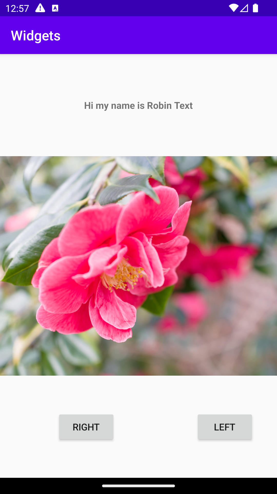

# Rapport

**Skriv din rapport här!**

Rapport:
I uppgiften för att kunna organisera sina widgetar i appen
behövde man antingen använda sig av LinearLayout eller
en ConstraintLayout. Jag använde mig av ConstraintLayout. 
Vilket man kan se i ex denna kod:layout_constraintBottom_toBottomOf="parent".
Efter man valt sin layout la jag till tre olika widgetar
som var: EditText som presenteras i koden som android:id="@+id/textView". 
imageView som presenteras i koden som android:id="@+id/imageView2". Sen
två button som nämndes till android:id="@+id/button" samt 
android:id="@+id/button2".

Kodexempel:
Jag tog två kod exempel jag ville demonstrera, där knapparna 
har texterna vänster samt höger. Med hjälp av x och y 
koordinater hamnade knapparna på olika ställen.
(221dp, 357dp (för den första knappen), och 77dp, 357dp 
för den andra knappen). Första knappen placeras då 
221dp från vänster håll och 357dp från toppen samt,
andra knappen placeras 357dp från toppen 
77dp från vänster håll. Dessa dp-positioner bestämmer 
vart knappar skall finnas på layouten.


```
 <Button
        android:id="@+id/button"
        android:layout_width="wrap_content"
        android:layout_height="wrap_content"
        android:text="Left"
        tools:layout_editor_absoluteX="221dp"
        tools:layout_editor_absoluteY="357dp" />

    <Button
        android:id="@+id/button2"
        android:layout_width="wrap_content"
        android:layout_height="wrap_content"
        android:text="Right"
        tools:layout_editor_absoluteX="77dp"
        tools:layout_editor_absoluteY="357dp" 
```
Bild:




För/nackdelar
Fördelar: Fördel var att det var en enkel kod som var lätt
att förstå. Det var lätt att se hur appen utvecklades, när 
man kodade då allt syntes direkt på layouten. 

nackdelar: Eftersom knapparna var hårtkodade med ett antal
specifika värden kan de bli problem med anpassningen för 
layouten på skärmstorlekar i framtiden. Det kan se konstigt 
ut i framtiden på andra enheter.


